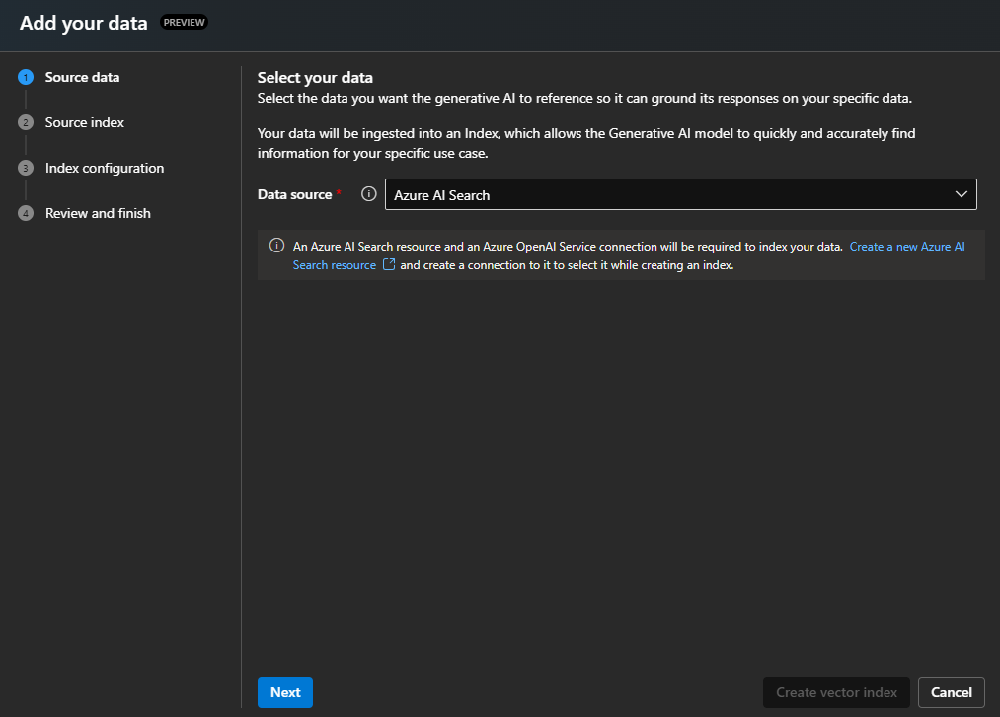
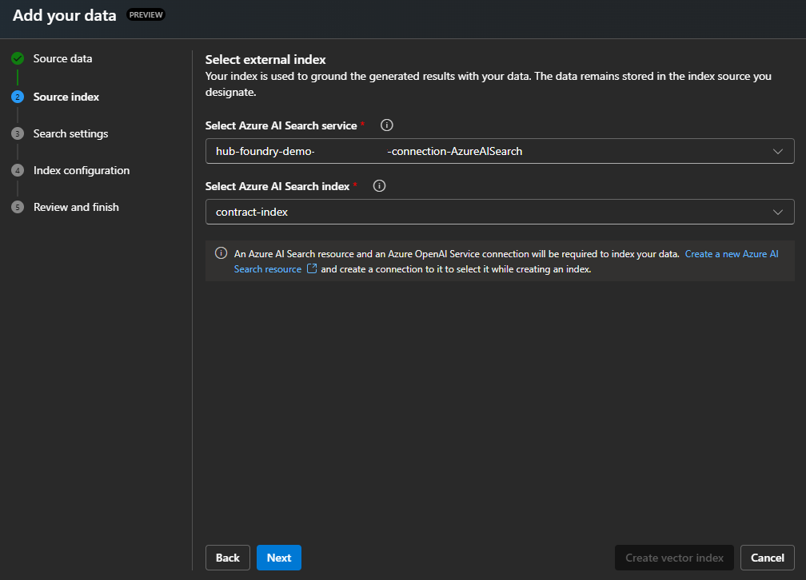
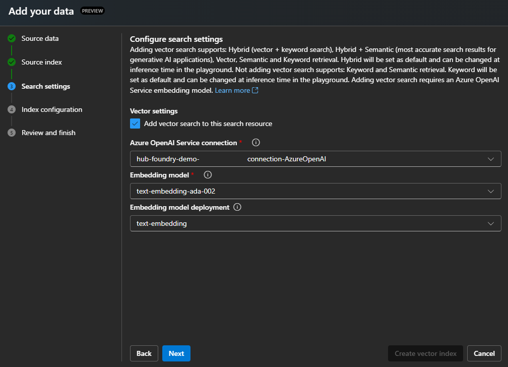
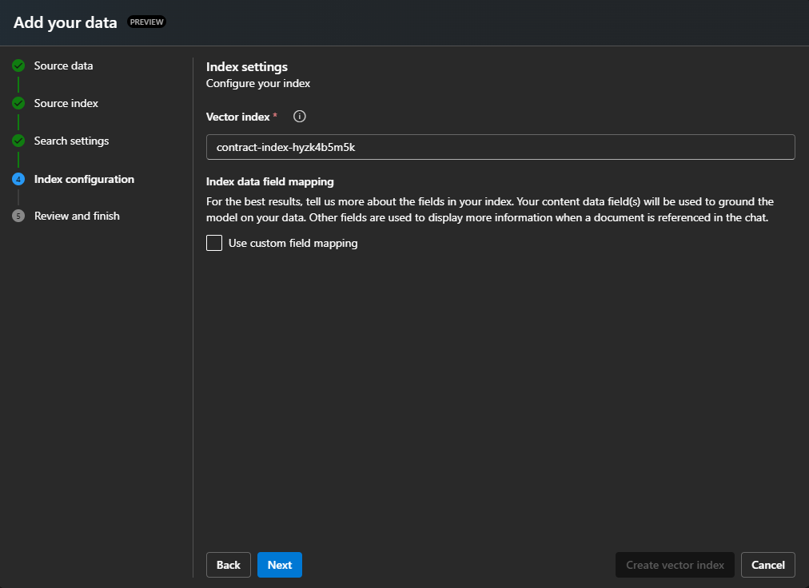

> ⚠️  
> **This project is currently in active development and may contain breaking changes.**  
> Updates and modifications are being made frequently, which may impact stability or functionality. This notice will be removed once development is complete and the project reaches a stable release.  

# Azure AI Foundry Deployment: Networking, Security, and Model Hosting  

## Overview  

This project implements the **Azure AI Baseline Reference Architecture** to deploy an **Azure AI Foundry** following best practices for networking, security, and model integration. It provisions the infrastructure necessary for chatting over data using managed models such as:  
- **Ada-002** for text embeddings  
- **GPT-4o** for natural language generation  
- **Phi-4** open mulit-model deployed as serverless api  

The solution automates the deployment of **Azure AI Foundry** services, including hubs, projects, and networking components, using **PowerShell** and **Bicep** templates. It also integrates observability through **Log Analytics** and **Application Insights** for monitoring and diagnostics.  


#### Key Features  

- **Azure AI Foundry Deployment:**  
  - Deploys **AI Hub**, **AI Project**, and **AI Services** for model hosting and generative AI solutions.  
  - Uses **private endpoints** and **managed identities** for secure access.  

- **Networking and Security:**  
  - Creates a **VNet** with subnets and a **VPN Gateway** for remote access.  
  - Securlty route and manage traffic with **private endpoints**.  

- **Model Integration:**  
  - Supports **chat over data** with **GPT-4o** and **Phi-4**.  
  - Enables **vector search** and **RAG** with **Azure AI Search**.  

- **Infrastructure as Code:**  
  - Uses **Bicep** and **PowerShell** for automated deployment.  
  - Ensures modular, reusable templates.  


## 📦 Resources  


 **Azure AI Foundry Reference Architecture**  
This project builds on the Azure AI Baseline Reference Architecture to help you design and deploy enterprise-grade generative AI solutions. It incorporates networking, security, and authorization best practices, enabling a scalable and secure AI environment.  
🔗 [Azure AI Baseline Reference Architecture](https://learn.microsoft.com/en-us/azure/architecture/ai-ml/architecture/baseline-openai-e2e-chat)  


**AI Model Deployment in Azure AI Foundry**  
To explore model deployment options, including serverless models, fine-tuning, and inference endpoints, refer to the official documentation.  
🔗 [Deploy AI Models in Azure AI Foundry Portal](https://learn.microsoft.com/en-us/azure/ai-foundry/concepts/deployments-overview)  
🔗 [Deploy models as serverless APIs](https://learn.microsoft.com/en-us/azure/ai-foundry/how-to/deploy-models-serverless)  


## ⚙️ Key Components  


### **AI Foundry Deployment**  
📁 [infra/core/ai/aifoundry](infra/core/ai/aifoundry)  

This module handles the deployment of **Azure AI Foundry**, enabling a scalable and secure infrastructure for AI workloads. It provisions the necessary **AI Hub**, **AI Projects**, and **AI Services** to support model inference, data processing, and RAG applications.  

#### **Features:**  
- **AI Hub:**  
  - Centralized management and governance for AI projects.  
  - Streamlines deployment and operations of multiple AI services.  

- **AI Projects:**  
  - Deploys project-specific environments with isolated resources.  
  - Supports model inference, fine-tuning, and data handling.  

- **AI Services:**  
  - Provisions services for hosting and executing **managed models** (e.g., GPT-4o, Phi-4).  
  - Enables **serverless deployment** for flexible scaling.  

- **Networking and Security:**  
  - Integrates with **private endpoints** for secure communication.  
  - Ensures controlled access and data isolation.  
  - Adds **diagnostic settings** for auditing and monitoring.  

--- 

### **Networking and Security**  
📁 [infra/core/networking](infra/core/networking)  

This module defines the **network architecture**, ensuring secure and isolated communication between components. It includes **VNets**, **subnets**, and a **VPN Gateway** to establish remote connectivity.  

#### **Features:**  
- **Virtual Network (VNet):**  
  - Creates a **VNet** with multiple subnets for component isolation.  
  - Assigns custom address spaces and integrates **service endpoints**.  

- **Subnets:**  
  - **Web Subnet:** For hosting web applications with private endpoints.  
  - **AI Subnet:** For connecting to **Azure Cognitive Services**.  
  - **Data Subnet:** For secure access to **Azure Storage** and **Cosmos DB**.  
  - **Services Subnet:** Reserved for internal service communication.  
  - **Gateway Subnet:** Dedicated for the **VPN Gateway**.  

- **VPN Gateway:**  
  - Provides secure remote access to the environment.  
  - Supports **site-to-site** and **point-to-site** connections.  
  - Routes all traffic through the VPN for enhanced security.  

--- 

### **Observability and Monitoring**  
📁 [infra/core/monitor](infra/core/monitor)  

This module implements **end-to-end observability** by configuring logging, monitoring, and diagnostics. It enables real-time visibility into the system’s performance, health, and security.  

#### **Features:**  
- **Log Analytics:**  
  - Collects and aggregates logs from **AI services, networking, and security**.  
  - Provides insights for troubleshooting and optimization.  

- **Application Insights:**  
  - Monitors application performance and usage patterns.  
  - Tracks request/response metrics, exceptions, and dependencies.  

- **Diagnostic Settings:**  
  - Enables diagnostic logs and metrics for auditing.  
  - Tracks network activity, VPN traffic, and AI service performance.  
  


---

## 🚀 Usage

### Requirements  
- **Azure Subscription:** Ensure you have an active Azure subscription with sufficient privileges to create and manage resources.  
- **Azure CLI:** Install the [Azure CLI](https://learn.microsoft.com/en-us/cli/azure/get-started-with-azure-cli) for managing Azure resources.  
- **IDE with Bicep, PowerShell Support:** Use an IDE such as [VS Code](https://code.visualstudio.com/download) with the **Bicep extension** for development and validation.  


### Deployment Steps

#### 1. Clone the Repository  
Start by cloning the repository to your local machine using the following command:

```bash
git clone https://github.com/jonathanscholtes/azure-ai-search-large-doc-indexing-vectorization.git
cd azure-ai-search-large-doc-indexing-vectorization
```


#### 2. Deploy the Solution  
Navigate to the infrastructure directory:

```bash
cd infra
```

Run the following PowerShell command to deploy the solution. Replace the placeholders with your actual subscription name and Azure region. The `-DeployVpnGateway` flag is optional for deploying the Azure VPN Gateway:

```powershell
.\deploy.ps1 -Subscription '[Subscription Name]' -Location 'eastus2'
```

✅ This script provisions all required Azure resources based on the specified parameters. The deployment may take up to **40 minutes** to complete.


#### 3. Download the VPN Client  (Optional)


Once the deployment is complete, follow these steps to download the VPN client:  
- Go to the **Azure Portal** → **Virtual Network Gateway** → **Point-to-Site Configuration**.  
- Click **Download VPN Client**.  
- Install the client on your local machine to securely connect to the Azure environment.

---

### Loading Index Data and Validating

#### 1. Configure Storage Account Access  

To upload sample documents into the Azure Storage Account and enable embedding creation, you must allow access by configuring the Storage Account firewall settings. This ensures that your local environment can communicate with Azure services.

Follow these steps to add your client IP address to the firewall settings:

1. Log in to the [Azure portal](https://portal.azure.com).
2. Navigate to your **Storage Account**.
3. In the **Networking** section, go to **Public network access** and select **Manage**.
4. Add your current client IP address to the list of allowed addresses.

#### 2. Upload Documents for Indexing with Azure Function  

Upload the JSON documents from the [data](data) directory to the **load** container in the Azure Storage Account. This upload will trigger the document processing function, which will chunk and index the documents into Azure AI Search. 

#### 3. Add Vector Index to Azure AI Foundry

In-order to use the Playground to chat over the vector data storaed in Azure AI Search, we will have to add our Azure AI Search index as a data soruce.

**Add Azure AI Search Index**


**Select AI Search Source Location**
Select **Azure AI Search** as the data source:


**Select AI Search Source Index**
Then select the instance of **Azure AI Search** that has been deployed as a connection with this solution and select the index _contract-index_:



**Select AI Search Settings**
In-order to perform a vector search we will need to specify a text embedding mode, select the mode _text-embedding_ that is deployed to **Azure AI Foundry** with this solution: 


**Select AI Search Index Settings**
Finaly keep the defaults before processed to the review and finish step:



---

## ♻️ Clean-Up

After completing testing, ensure to delete any unused Azure resources or remove the entire Resource Group to avoid incurring additional charges.


## 📜 License
This project is licensed under the [MIT License](LICENSE.md), granting permission for commercial and non-commercial use with proper attribution.


## Disclaimer
This demo application is intended solely for educational and demonstration purposes. It is provided "as-is" without any warranties, and users assume all responsibility for its use.
