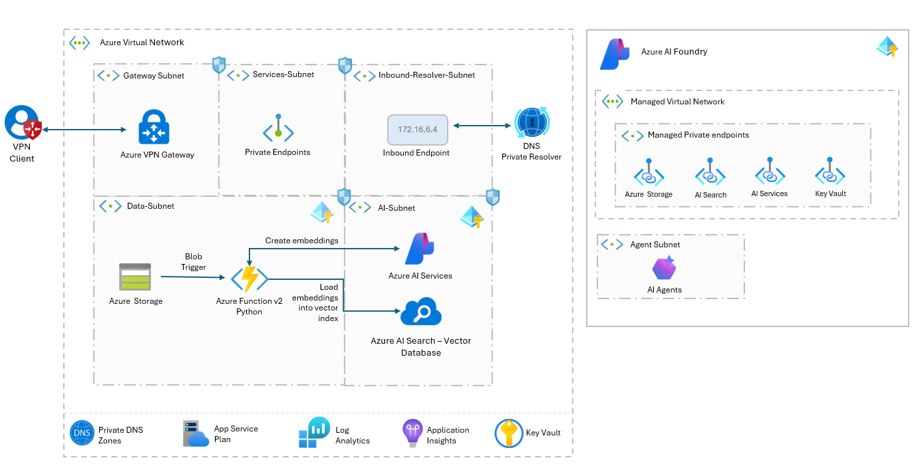

> ⚠️  
> **This project is currently in active development and may contain breaking changes.**  
> Updates and modifications are being made frequently, which may impact stability or functionality. This notice will be removed once development is complete and the project reaches a stable release.  

# Azure AI Foundry Deployment: Networking, Security, and Model Hosting  

## Overview  

This project implements the **Azure AI Baseline Reference Architecture** to deploy an **Azure AI Foundry** following best practices for networking, security, and model integration. It provisions the infrastructure necessary for chatting over data using managed models such as:  
- **Ada-002** for text embeddings  
- **GPT-4o** for natural language generation  
- **Phi-4** open mulit-model deployed as serverless api  

The solution automates the deployment of **Azure AI Foundry**, including AI Hubs, AI Projects, and networking components, using **PowerShell** and **Bicep** templates. It incorporates observability through **Log Analytics**  and **Application Insights** for real-time monitoring and diagnostics. Additionally, it integrates **Azure Functions** with Blob Triggers for event-driven processing of JSON documents, chunking document text, extracing meta data, generating vector embeddings with the Ada-002 model, and indexing  into **Azure AI Search** to enable retrieval-augmented generation (RAG) and semantic search that will be tested using the PlayGround.

#### Key Features  

- **Azure AI Foundry Deployment:**  
  - Deploys **AI Hub**, **AI Project**, and **AI Services** for model hosting with secure access via **private endpoints** and **managed identities**.  

- **Networking and Security:**  
  - Creates a **VNet** with subnets, a **VPN Gateway** for remote access, and **private endpoints** for secure communication.  

- **Model Integration:**  
  - Enables **chat over data** with **GPT-4o** and **Phi-4**.  
  - Supports **vector search** and **RAG** with **Azure AI Search**.  
  - Generates **Ada-002** vector embeddings from JSON documents.  

- **Vector Processing Pipeline:**  
  - Uses **Azure Blob Storage** triggers to process new JSON files with **Azure Functions**.  
  - Extracts content, generates **Ada-002** embeddings, and indexes them in **Azure AI Search** for semantic retrieval and **RAG**.  

- **Infrastructure as Code:**  
  - Automates deployment with **Bicep** and **PowerShell** using modular, reusable templates.

## 🔗 Reference Materials

 **Azure AI Foundry Reference Architecture**  
This project builds on the Azure AI Baseline Reference Architecture to help you design and deploy enterprise-grade generative AI solutions. It incorporates networking, security, and authorization best practices, enabling a scalable and secure AI environment.  
🔗 [Azure AI Baseline Reference Architecture](https://learn.microsoft.com/en-us/azure/architecture/ai-ml/architecture/baseline-openai-e2e-chat)  

Please review the **quickstart** templates that demonstrates how to set up Azure AI Foundry with a network-restricted configuration.
🔗 [Azure AI Foundry Template - Network Restricted ](https://github.com/Azure/azure-quickstart-templates/tree/master/quickstarts/microsoft.machinelearningservices/aifoundry-network-restricted)  

🔗 [Azure AI Foundry Agents Template - Network Restricted ](https://github.com/Azure/azure-quickstart-templates/tree/master/quickstarts/microsoft.azure-ai-agent-service/network-secured-agent)  

**AI Model Deployment in Azure AI Foundry**  
To explore model deployment options, including serverless models, fine-tuning, and inference endpoints, refer to the official documentation.  
🔗 [Deploy AI Models in Azure AI Foundry Portal](https://learn.microsoft.com/en-us/azure/ai-foundry/concepts/deployments-overview)  
🔗 [Deploy models as serverless APIs](https://learn.microsoft.com/en-us/azure/ai-foundry/how-to/deploy-models-serverless)  

---

## 🛠️ **Core Steps for Solution Implementation**

Follow these key steps to successfully deploy Azure AI Foundry:

### 1️⃣ [**Solution Deployment**](docs/deployment.md)
- Step-by-step instructions for deploying Azure AI Foundry, including prerequisites and configuration.   

### 2️⃣ [**Vector Processing Pipeline**](docs/vector-processing.md)
-  Guide for processing and indexing documents into Azure AI Search for vector search with Azure AI Foundry.  

### 3️⃣ [**Validate Online Endpoint**](docs/online-endpoints.md)  
- Instructions for validating the deployment and connectivity of the Hugging Face model hosted on an online endpoint.  

---

## ♻️ Clean-Up

After completing testing, ensure to delete any unused Azure resources or remove the entire Resource Group to avoid incurring additional charges.

## 📜 License
This project is licensed under the [MIT License](LICENSE.md), granting permission for commercial and non-commercial use with proper attribution.

## Disclaimer
This demo application is intended solely for educational and demonstration purposes. It is provided "as-is" without any warranties, and users assume all responsibility for its use.
