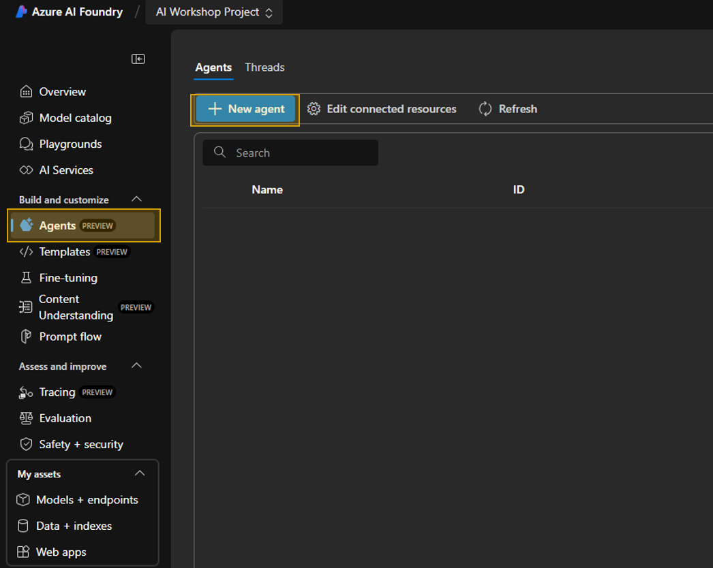
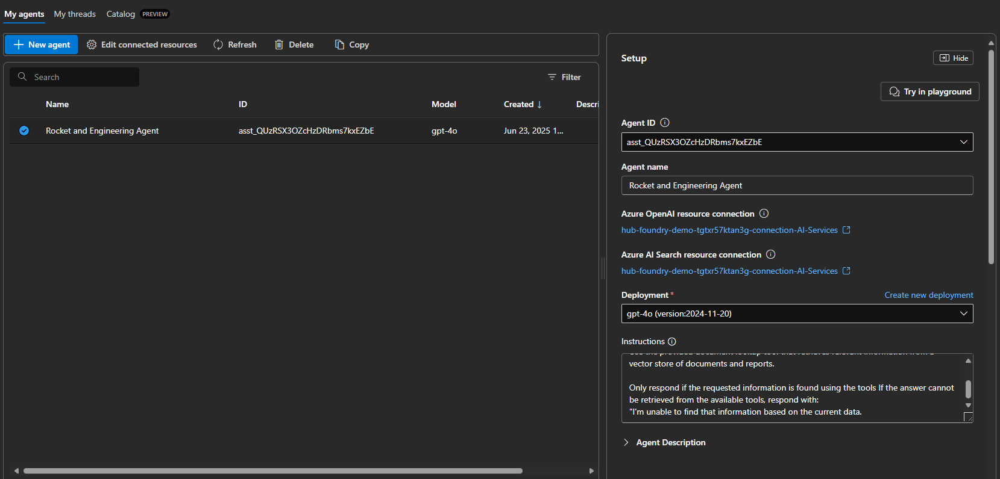
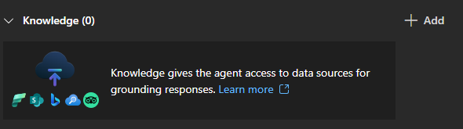
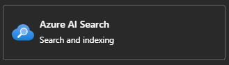
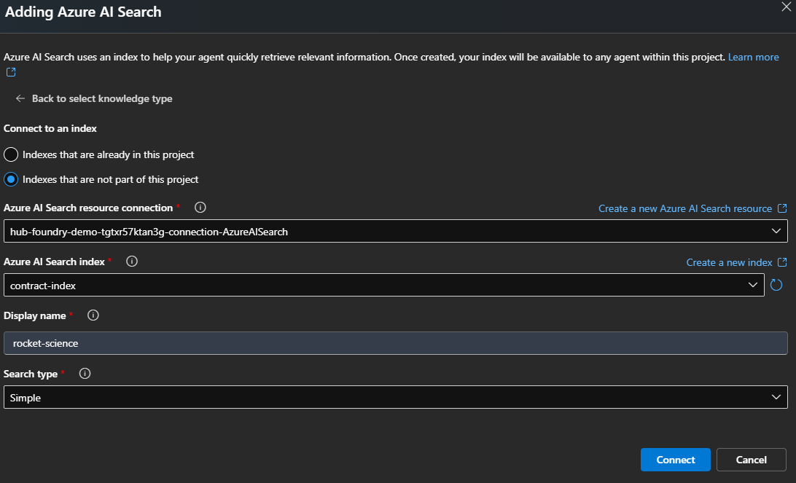
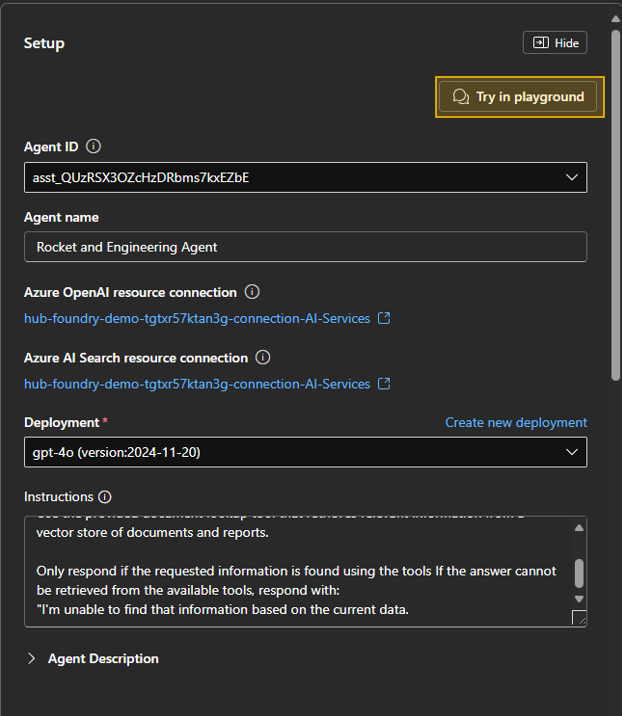
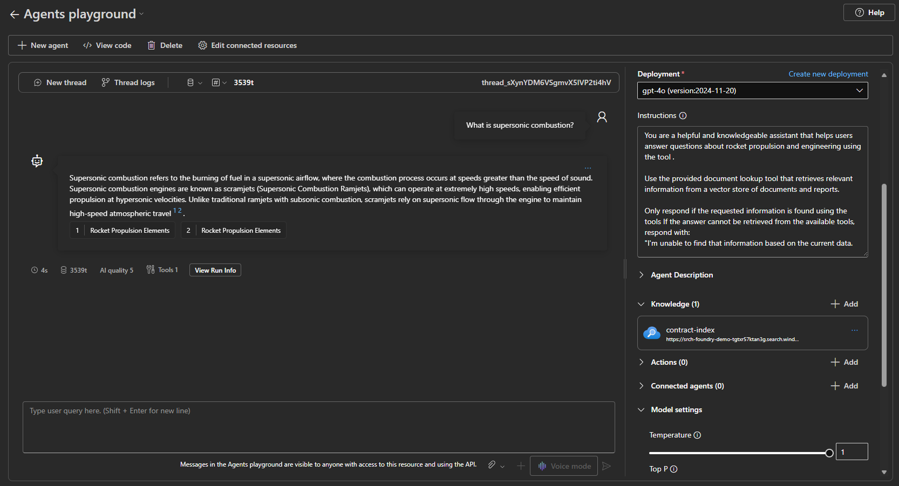

## Build Smart, Actionable AI with Azure AI Agent Service (Portal)

The [Azure AI Agent Service](https://learn.microsoft.com/en-us/azure/ai-services/agents/overview) is a fully managed platform designed to help developers create intelligent, context-aware agents—without the overhead of managing compute or storage infrastructure. These agents are extensible, secure, and capable of reasoning over documents and interacting with external APIs.

In this walkthrough, you'll build an AI agent that performs two key tasks:
- Retrieves contextual information from **Azure AI Search**

---

#### ⚙️ Step-by-Step: Creating a New Azure AI Agent

Let’s walk through how to set up an agent that uses knowledge retrieval with Azure AI Search.

##### 1. Create a New Agent

In your **AI Project** within Azure AI Foundry, navigate to the **Agents** section and click **+ Create Agent**.

---

##### 2. Define Your Agent’s Role and Instructions

Provide your agent with a clear name and set of instructions. Here’s an example configuration:

> You are a helpful and knowledgeable assistant that helps users answer questions about rocket propulsion and engineering using the tool.
>
> Use the provided document lookup tool that retrieves relevant information from a vector store of documents and reports.
>
> Only respond if the requested information is found using the tools If the answer cannot be retrieved from the available tools, respond with:
"I'm unable to find that information based on the current data.

---

##### 3. Add a Knowledge Source

To enable contextual awareness, add **Azure AI Search** as a knowledge source. This allows the agent to pull insights directly from your indexed documents.

- Click **+ Add** under **Knowledge**
- Select **Azure AI Search**

 

**Connect to an index**

- Select you **Azure AI Search** resource and **index**
- provide a **Display Name** for your index
- Choose your **Search type**, (Simple or Semantic)

---

##### 4. 🧪 Test the Agent in Playground

Once your agent is configured with both knowledge and actions, test it using the **Playground** feature.

Try asking:

> **"What is Supersonic combustion?"**  
This will perform vector-based retrieval over your indexed documents in Azure AI Search.

