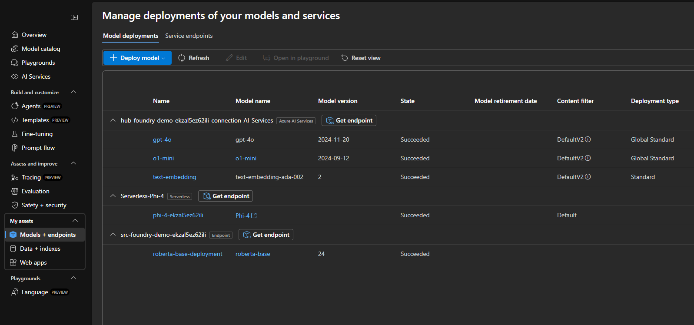
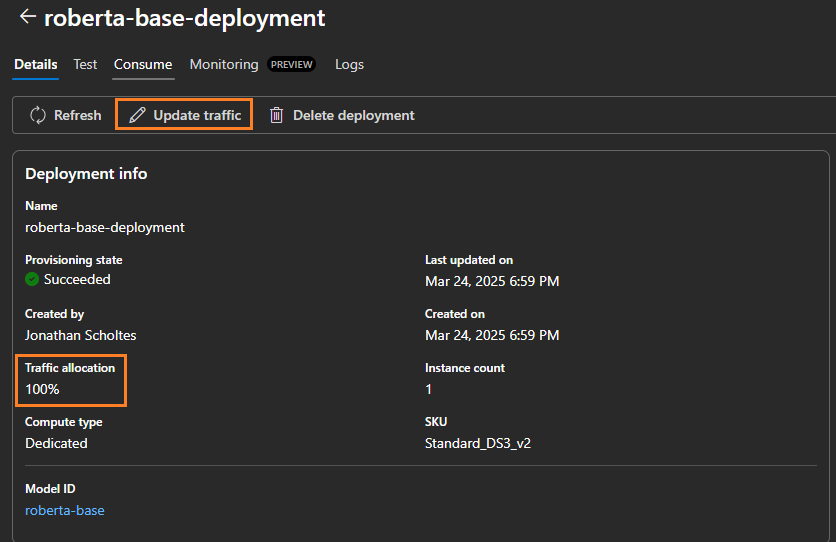
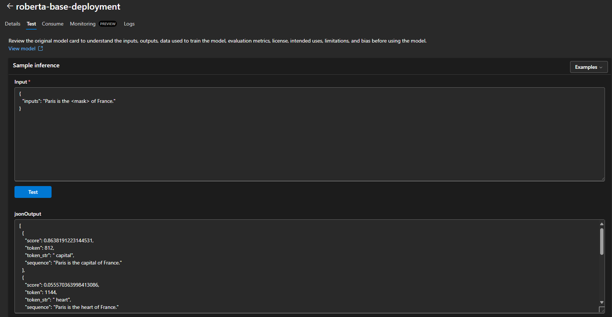

###  **Validating the Managed Online Endpoint**

As part of this project, the **`roberta-base`** model from **Hugging Face** is deployed. This is a pre-trained language model optimized for the **fill-mask** task within the Transformers library. The model was selected in alignment with the **Azure AI Foundry** tutorial:  
🔗 [How to deploy and inference a managed compute deployment with code](https://learn.microsoft.com/en-us/azure/ai-foundry/how-to/deploy-models-managed)  

The model is deployed under the **Endpoint** section:  

  

---

###  **Traffic Configuration Validation**  

Verify that the online endpoint routes **100% of the traffic** to the deployed model. If the traffic is distributed differently, update the configuration to ensure all inference requests are directed to the intended model:  

  

---

###  **Model Testing and Verification**  

To confirm the endpoint is operational, execute a test inference request:  

1. Select **Test** in the Azure AI Studio interface.  
2. Provide the following sample input payload:  

```json
{
  "inputs": "Paris is the <mask> of France."
}
```

  

✅ This test ensures the model is successfully deployed and capable of performing accurate inferences through the managed online endpoint.