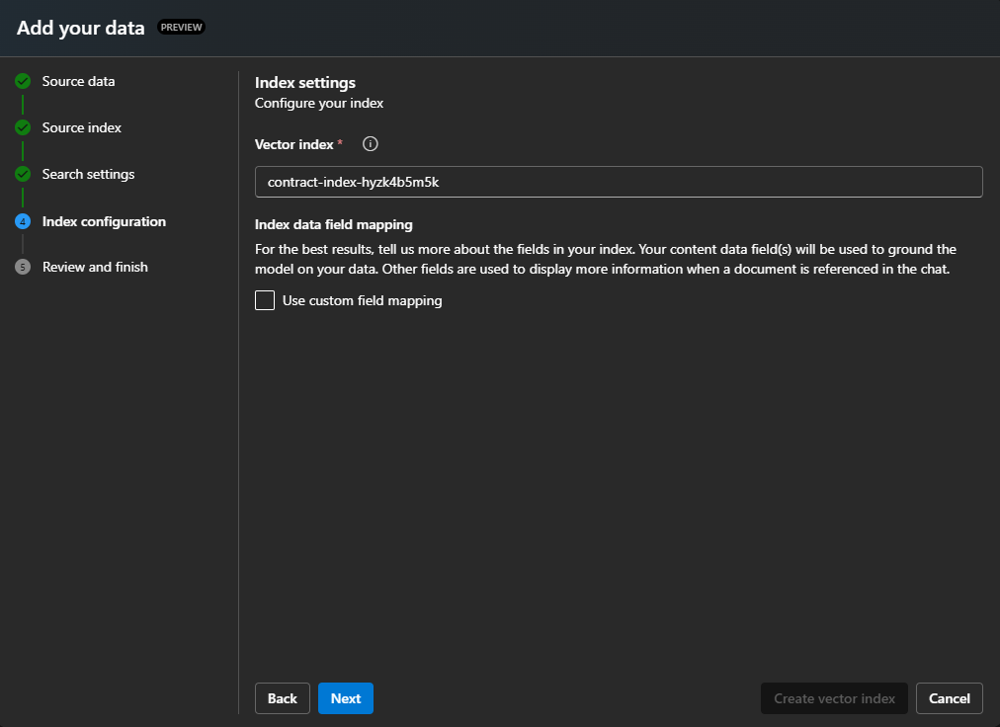

## Loading Index Data and Validating

### 1. Configure Storage Account Access  

To upload sample documents into the Azure Storage Account and enable embedding creation, you must allow access by configuring the Storage Account firewall settings. This ensures that your local environment can communicate with Azure services.

Follow these steps to add your client IP address to the firewall settings:

1. Log in to the [Azure portal](https://portal.azure.com).
2. Navigate to your **Storage Account**.
3. In the **Networking** section, go to **Public network access** and select **Manage**.
4. Add your current client IP address to the list of allowed addresses.

### 2. Upload Documents for Indexing with Azure Function  

Upload the JSON documents from the [data](data) directory to the **load** container in the Azure Storage Account. This upload will trigger the document processing function, which will chunk and index the documents into Azure AI Search. 

### 3. Add Vector Index to Azure AI Foundry

To chat with the vector data stored in **Azure AI Search** using the Playground, you need to add your Azure AI Search index as a data source.

#### 1. **Add Data Source – Azure AI Search Index**
In the Playground, click on **`+ Add a new data source`**.  
   

#### 2. **Select AI Search Source Location**
Choose **Azure AI Search** as the data source.  
  

#### 3. **Select AI Search Source Index**
Select the deployed instance of **Azure AI Search** associated with this solution, and choose the index named `_contract-index_`.  
   

#### 4. **Select AI Search Settings**
To perform a vector search, specify the text embedding mode.  
   - Select the mode `_text-embedding_`, which is deployed to **Azure AI Foundry** with this solution.  
   

#### 5. **Select AI Search Index Settings**
Keep the default settings and proceed to the **Review and Finish** step.  
   

#### 6. **Chat with Azure AI Search Vector Indexes**
With the new data source added, you can now chat with the vector data using the Playground.  
For example, if you uploaded data related to rocket propulsion, you can ask:  
**"What is supersonic combustion?"**  
   